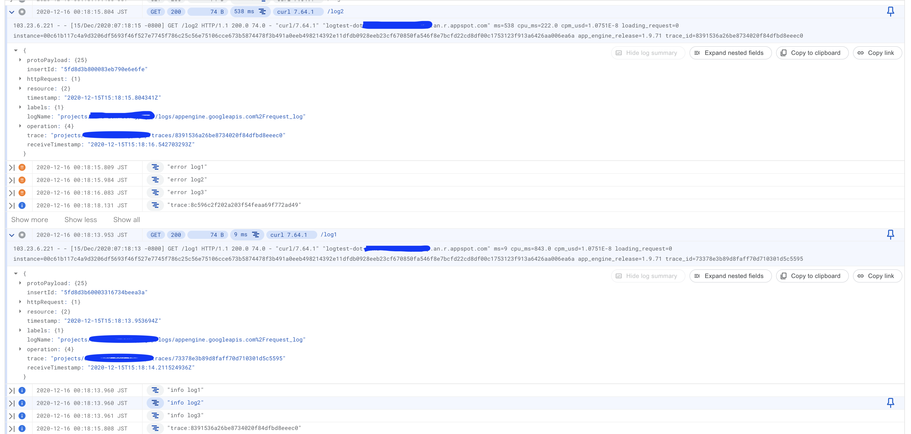

# log-error-too-slow project

## appengine deployment
```
 ./gradlew appengineDeploy -PgcpProjectId=${YOUR_PROJECT_ID} -PgcpVersion=v1 --stacktrace
 ```

```
curl https://{YOUR_PROJECT_ID}.an.r.appspot.com/log1
curl https://{YOUR_PROJECT_ID}.an.r.appspot.com/log2
```

## Log capture

